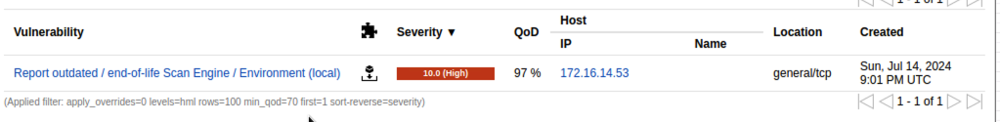
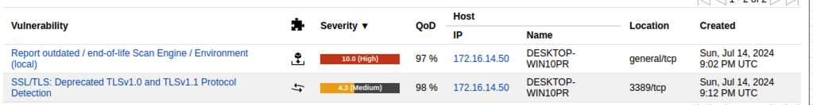
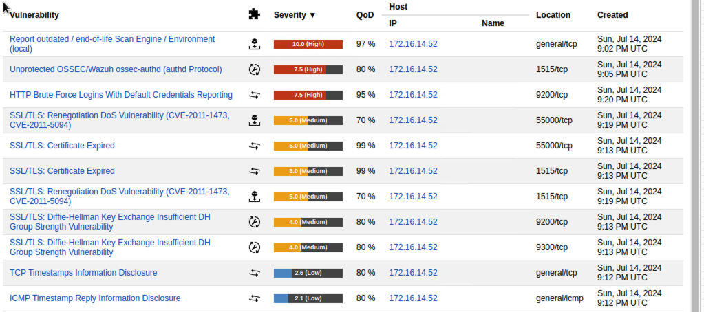

# Cat's Company Vulnerabilities
### Andrew McGowan

## Table of Contents:
1. [Executive Summary](#executive-summary)
2. [Scan Results](#scan-results)
3. [Methodology](#methodology)
4. [Findings](#findings)
   - [Winserver (172.16.14.53)](#winserver-172161453)
   - [Windows1 (172.16.14.50)](#windows1-172161450)
   - [Linux Server (172.16.14.52)](#linux-server-172161452)
5. [Risk Assessment](#risk-assessment)
   - [Solution Type Definitions](#solution-type-definitions)
6. [Recommendations](#recommendations)
   - [High Severity](#high-severity)
   - [Medium Severity](#medium-severity)
   - [Low Severity](#low-severity)
7. [Conclusion](#conclusion)
8. [References](#references)

## [Executive Summary:](#executive-summary)
On July 14th, 2024, a comprehensive vulnerability assessment was conducted on the network 172.16.14.0/24 using OpenVAS. The primary objective was to identify and prioritize security weaknesses, thereby enhancing the organization's overall security posture. The assessment focused on critical areas such as outdated software, insecure configurations, and deprecated protocols. The scan revealed a total of 11 vulnerabilities across three key hosts: Winserver, Windows1, and Linux Server. These vulnerabilities were categorized based on their severity levels—high, medium, and low—allowing for a structured approach to remediation.

High-severity vulnerabilities were given the utmost priority due to their potential impact on the organization's operations and security. This report provides a detailed analysis of the vulnerabilities, affected systems, potential business impact, and recommended mitigation strategies. The ultimate goal is to equip the executive team with the necessary information to make informed decisions and implement effective security measures promptly. By addressing these vulnerabilities, the organization can significantly reduce its risk exposure and improve its overall security posture.

## [Scan Results:](#scan-results)
The scan identified a total of 11 vulnerabilities across three hosts (Winserver, Windows1, and Linux Server). The vulnerabilities were categorized and prioritized as follows:
- **High Severity (7.0-10):** Outdated software, unprotected services, and default credentials.
- **Medium Severity (4.0-6.9):** SSL/TLS vulnerabilities and expired certificates.
- **Low Severity (0-3.9):** Information disclosure issues.

## [Methodology:](#methodology)
- **Tools Used:** OpenVAS & Kali Linux
- **Purpose:** Identify vulnerabilities within the specified network range.
- **Environment:** Internal network scan targeting 172.16.14.0/24.

## [Findings:](#findings)

### [Winserver (172.16.14.53):](#winserver-172161453)
- **Outdated/End-of-life Scan Engine:** High severity, requires vendor fix.

### [Windows1 (172.16.14.50):](#windows1-172161450)
- **Outdated/End-of-life Scan Engine:** High severity, requires vendor fix.
- **Deprecated TLSv1.0 and TLSv1.1 Protocol Detection:** Medium severity, requires mitigation.

### [Linux Server (172.16.14.52):](#linux-server-172161452)
- **Outdated/End-of-life Scan Engine:** High severity, requires vendor fix.
- **Unprotected OSSEC/Wazuh ossec-authd:** High severity, requires workaround.
- **HTTP Brute Force Logins with Default Credentials:** High severity, requires mitigation.
- **SSL/TLS Renegotiation DoS Vulnerability:** Medium severity, requires vendor fix.
- **SSL/TLS Certificate Expired:** Medium severity, requires mitigation.
- **SSL/TLS Diffie-Hellman Key Exchange Insufficient DH Group Strength:** Medium severity, requires workaround.
- **TCP Timestamp Information Disclosure:** Low severity, requires mitigation.
- **ICMP Timestamp Reply Information Disclosure:** Low severity, requires mitigation.

## [Risk Assessment:](#risk-assessment)
The vulnerabilities are indexed and categorized below:

| Severity | Vulnerability                                      | Affected Host(s)        | Description                                                    | Solution Type  | CVE                         | MITRE ATT&CK Reference                                                                 |
|----------|----------------------------------------------------|-------------------------|----------------------------------------------------------------|----------------|-----------------------------|-----------------------------------------------------------------------------------------|
| High     | Outdated/End-of-life Scan Engine                   | Winserver, Windows1, Linux Server | Outdated software with no support                              | Vendor fix     | N/A                         | [T1498](https://attack.mitre.org/techniques/T1498/)                                     |
| High     | Unprotected OSSEC/Wazuh ossec-authd                | Linux Server            | Vulnerable authd protocol                                      | Workaround     | N/A                         | [T1078](https://attack.mitre.org/techniques/T1078/)                                     |
| High     | HTTP Brute Force Logins with Default Credentials   | Linux Server            | Default credentials allow easy brute force attacks             | Mitigation     | N/A                         | [T1110](https://attack.mitre.org/techniques/T1110/)                                     |
| Medium   | Deprecated TLSv1.0 and TLSv1.1 Protocol Detection  | Windows1                | Insecure TLS protocols detected                                | Mitigation     | N/A                         | [T1071.001](https://attack.mitre.org/techniques/T1071/001/)                             |
| Medium   | SSL/TLS Renegotiation DoS Vulnerability            | Linux Server            | DoS vulnerabilities in SSL/TLS renegotiation                   | Vendor fix     | [CVE-2011-1473](https://cve.mitre.org/cgi-bin/cvename.cgi?name=CVE-2011-1473), [CVE-2011-5094](https://cve.mitre.org/cgi-bin/cvename.cgi?name=CVE-2011-5094) | [T1499](https://attack.mitre.org/techniques/T1499/)                                     |
| Medium   | SSL/TLS Certificate Expired                        | Linux Server            | Expired SSL/TLS certificates                                   | Mitigation     | N/A                         | [T1551.007](https://attack.mitre.org/techniques/T1551/007/)                             |
| Medium   | Diffie-Hellman Key Exchange Insufficient DH Group  | Linux Server            | Weak DH group strength in key exchange                         | Workaround     | N/A                         | [T1071.001](https://attack.mitre.org/techniques/T1071/001/)                             |
| Low      | TCP Timestamp Information Disclosure               | Linux Server            | TCP timestamp information can be used to infer OS and uptime   | Mitigation     | N/A                         | [T1040](https://attack.mitre.org/techniques/T1040/)                                     |
| Low      | ICMP Timestamp Reply Information Disclosure        | Linux Server            | ICMP timestamp information can be used to infer OS and uptime  | Mitigation     | N/A                         | [T1040](https://attack.mitre.org/techniques/T1040/)                                     |

### [Solution Type Definitions:](#solution-type-definitions)

1. **Vendor Fix:**
   - **Definition:** A resolution provided by the software or hardware vendor, typically in the form of patches or updates, which addresses and rectifies the identified vulnerabilities.
   - **Example:** Applying a software update released by Microsoft to fix a security bug in Windows.

2. **Workaround:**
   - **Definition:** A temporary solution that mitigates the risk of the vulnerability without fully resolving the underlying issue. This often involves configuration changes or alternative approaches to minimize exposure.
   - **Example:** Changing configuration settings to disable a vulnerable service until an official patch is released.

3. **Mitigation:**
   - **Definition:** Actions taken to reduce the impact or likelihood of the vulnerability being exploited. These measures do not eliminate the vulnerability but lower the associated risk.
   - **Example:** Implementing multi-factor authentication (MFA) to mitigate the risk of brute force attacks on accounts with default passwords.

## [Recommendations:](#recommendations)
### [High Severity:](#high-severity)
1. **Outdated/End-of-life Scan Engine (All Hosts):**
   - **Action:** Apply vendor fixes to update the software on Winserver, Windows1, and Linux Server.
   - **Time Frame:** **24 hours**
   - **Details:** Obtain and install the latest supported versions of the software. Coordinate with the vendor if necessary for guidance and support.

2. **Unprotected OSSEC/Wazuh ossec-authd (Linux Server):**
   - **Action:** Implement a workaround to secure the authd protocol by configuring strong authentication and access controls.
   - **Time Frame:** **24 hours**
   - **Details:** Update configurations, enforce strong authentication, and restrict access to necessary users only.

3. **HTTP Brute Force Logins with Default Credentials (Linux Server):**
   - **Action:** Change default credentials to strong, unique passwords and implement stronger authentication mechanisms such as multi-factor authentication (MFA).
   - **Time Frame:** **48 hours**
   - **Details:** Audit all accounts, enforce strong password policies, and set up MFA. Educate users on the importance of maintaining strong passwords.

### [Medium Severity:](#medium-severity)
1. **Deprecated TLS Protocols (Windows1):**
   - **Action:** Disable TLSv1.0 and TLSv1.1 and enforce TLSv1.2 or higher.
   - **Time Frame:** **48 hours**
   - **Details:** Update server configurations to disable outdated protocols and ensure compatibility with clients using TLSv1.2 or higher.

2. **SSL/TLS Renegotiation DoS Vulnerability (Linux Server):**
   - **Action:** Apply vendor fixes to address the DoS vulnerabilities by updating the SSL/TLS library and configurations.
   - **Time Frame:** **72 hours**
   - **Details:** Apply patches from the vendor and verify the effectiveness of the fixes through testing.

3. **SSL/TLS Certificate Expired (Linux Server):**
   - **Action:** Renew expired SSL/TLS certificates and ensure they are replaced before expiration in the future.
   - **Time Frame:** **72 hours**
   - **Details:** Acquire new certificates, update server configurations, and set reminders for future renewals.

4. **Diffie-Hellman Key Exchange Weakness (Linux Server):**
   - **Action:** Use stronger Diffie-Hellman groups for key exchange by updating server configurations to use a minimum of 2048-bit DH groups.
   - **Time Frame:** **72 hours**
   - **Details:** Update configuration files to use stronger DH groups and test to ensure compatibility with clients.

### [Low Severity:](#low-severity)
1. **TCP Timestamp Information Disclosure (Linux Server):**
   - **Action:** Disable TCP timestamp responses to prevent information disclosure.
   - **Time Frame:** **48 hours**
   - **Details:** Modify kernel parameters to disable TCP timestamps and verify that timestamps are not being sent.

2. **ICMP Timestamp Reply Information Disclosure (Linux Server):**
   - **Action:** Disable ICMP timestamp replies to prevent information disclosure.
   - **Time Frame:** **48 hours**
   - **Details:** Adjust firewall rules and system configurations to block ICMP timestamp requests and verify the settings.

## [Conclusion:](#conclusion)
Addressing the identified vulnerabilities is critical to maintaining the security and integrity of the organization's network. High-severity issues, such as outdated software and unprotected services, should be prioritized to mitigate significant risks. Implementing the recommended actions will enhance the overall security posture and reduce the likelihood of potential breaches. Regular vulnerability assessments and updates to security policies are essential to ensure ongoing protection against emerging threats.

## [References:](#references)
- Greenbone OpenVAS. (n.d.). Documents. Greenbone. Retrieved July 14, 2024, from [https://www.greenbone.net/en/documents/](https://www.greenbone.net/en/documents/)
- Mageni. (n.d.). HTTP Brute Force Logins With Default Credentials Reporting. Mageni. Retrieved July 14, 2024, from [https://www.mageni.net/vulnerability/http-brute-force-logins-with-default-credentials-reporting-103240](https://www.mageni.net/vulnerability/http-brute-force-logins-with-default-credentials-reporting-103240)
- Mageni. (n.d.). SSL/TLS: Deprecated TLSv1.0 and TLSv1.1 Protocol Detection. Mageni. Retrieved July 14, 2024, from [https://www.mageni.net/vulnerability/ssltls-deprecated-tlsv10-and-tlsv11-protocol-detection-117274](https://www.mageni.net/vulnerability/ssltls-deprecated-tlsv10-and-tlsv11-protocol-detection-117274)
- MITRE ATT&CK. (n.d.). ATT&CK Matrix for Enterprise. MITRE ATT&CK. Retrieved July 14, 2024, from [https://attack.mitre.org/](https://attack.mitre.org/)
- MyF5. (2020, December 22). K89130356: Vulnerability scan: Diffie-Hellman Key Exchange Insufficient DH Group Strength Vulnerability. MyF5. Retrieved July 14, 2024, from [https://my.f5.com/manage/s/article/K89130356](https://my.f5.com/manage/s/article/K89130356)
- MyF5. (2023, December 8). K000137636: TCP Timestamps Information Disclosure vulnerability. MyF5. Retrieved July 14, 2024, from [https://my.f5.com/manage/s/article/K000137636](https://my.f5.com/manage/s/article/K000137636)
- NIST. (n.d.). NVD. NIST: NVD. Retrieved July 14, 2024, from [https://nvd.nist.gov/](https://nvd.nist.gov/)
- Ohay, S. (2022, August 1). The Risks of Expired SSL Certificates. Crowdstrike Blog. Retrieved July 14, 2024, from [https://www.crowdstrike.com/blog/the-risks-of-expired-ssl-certificates/](https://www.crowdstrike.com/blog/the-risks-of-expired-ssl-certificates/)
- Pentest Tools. (n.d.). ICMP Timestamp Reply Information Disclosure. Pentest Tools. Retrieved July 14, 2024, from [https://pentest-tools.com/vulnerabilities-exploits/icmp-timestamp-reply-information-disclosure_16580](https://pentest-tools.com/vulnerabilities-exploits/icmp-timestamp-reply-information-disclosure_16580)
- Ristic, I. (2011, October 31). TLS Renegotiation and Denial of Service Attacks. Qualys Community. Retrieved July 14, 2024, from [https://blog.qualys.com/product-tech/2011/10/31/tls-renegotiation-and-denial-of-service-attacks](https://blog.qualys.com/product-tech/2011/10/31/tls-renegotiation-and-denial-of-service-attacks)
- Security Space. (n.d.). Unprotected OSSEC/Wazuh ossec-authd. Security Space. [https://www.securityspace.com/smysecure/catid.html?id=1.3.6.1.4.1.25623.1.0.108547](https://www.securityspace.com/smysecure/catid.html?id=1.3.6.1.4.1.25623.1.0.108547)
